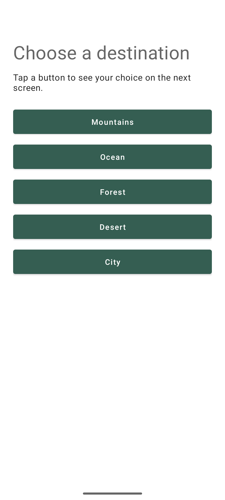
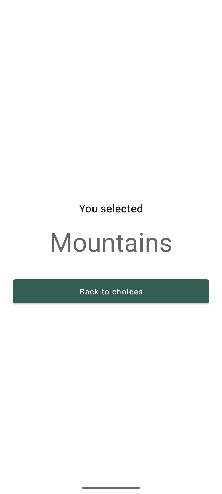
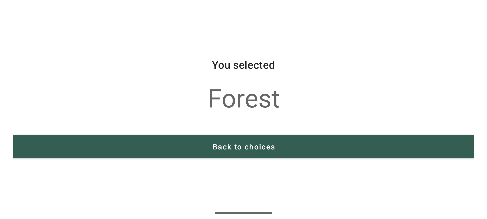

# Assignment 1 — Button Explorer

A simple Kotlin app following the **Empty Views Activity** structure: XML layouts,
View Binding, one `AppCompatActivity`, and two fragments. The implementation follows
the binding and lifecycle patterns in the repository's EmailSplitter examples.

## Run in Android Studio

1. Open this `Assignment 1` folder as a project and let Gradle sync.
2. Use Android Studio's bundled JDK and install Android SDK 37 if prompted.
3. Run the `app` configuration on an emulator or device running Android 7.0 (API 24) or newer.

## Implementation

- `MainActivity` hosts a `FragmentContainerView` and uses fragment transactions to
  replace the first fragment with the second, adding the transaction to the back stack.
- `FirstFragment` shows five destination buttons. One shared method configures their
  listeners, passes the clicked button's text, and shows a confirmation Toast.
- `SecondFragment.newInstance` puts the text in a `Bundle` attached to `arguments`.
  The second fragment displays it and provides a **Back to choices** button.
  Android's system Back also returns to the first fragment.
- The activity only adds the initial fragment on a fresh launch. FragmentManager
  restores the screen and back stack after rotation, and the second fragment saves
  and restores its selected text with `onSaveInstanceState` and `onCreate`.
- Both fragments release their view bindings in `onDestroyView`.

## Verification

Verified on a Pixel 6 emulator running Android 16 (API 36): all five button texts,
both return controls, and selection/back-stack restoration across landscape and
portrait rotation passed. `assembleDebug` and `lintDebug` passed with zero lint
errors and three dependency-update suggestions for versions kept from the examples.

Build and lint from this folder:

```powershell
.\gradlew.bat assembleDebug lintDebug
```

With the debug APK installed and one emulator connected, run the repeatable UI check
(Python 3, no additional packages):

```powershell
python check_app.py "$env:LOCALAPPDATA/Android/Sdk/platform-tools/adb.exe"
```

The check exercises all five selections, the return button, system Back, and rotation.
It also captures the screenshots below and restores the emulator's rotation settings.

## Screenshots

Actual app captures from a Pixel 6 emulator running Android 16 (API 36).

### First fragment — five buttons



### Second fragment — clicked button text



### Selection preserved after rotation


