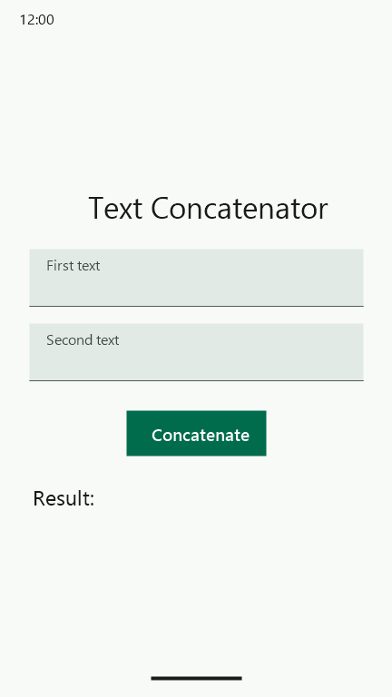
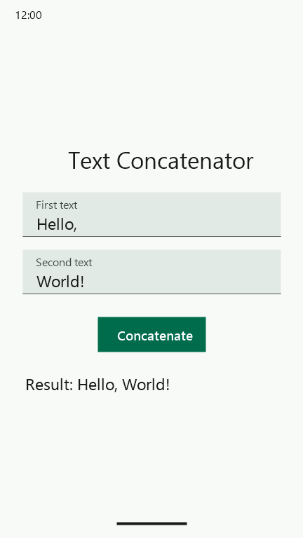
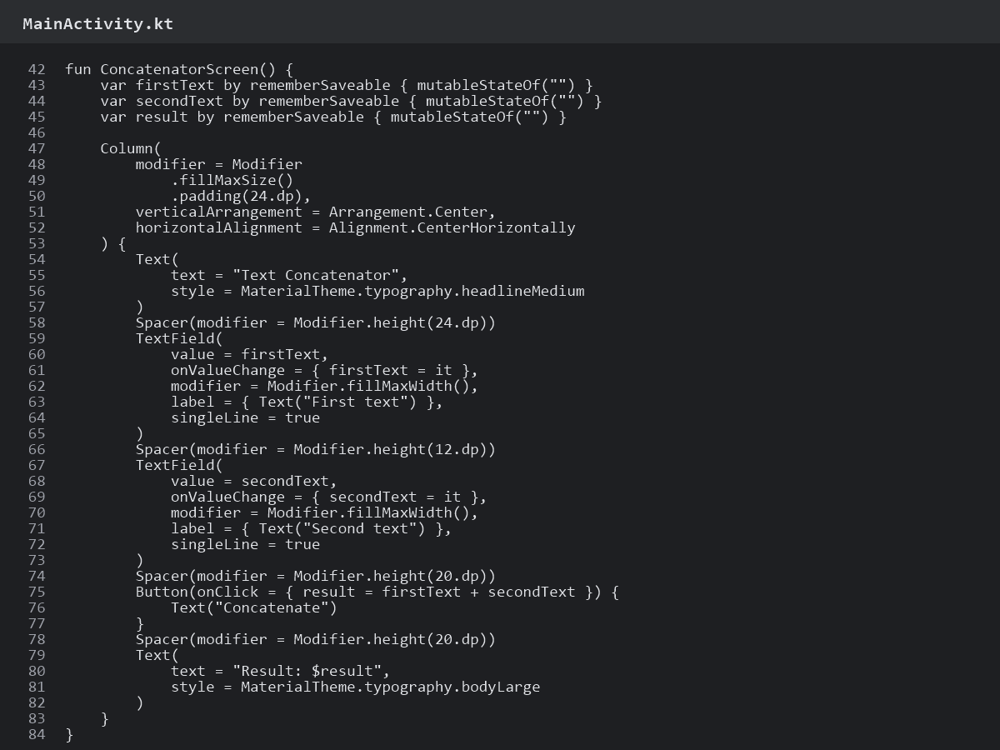

# In-Class Practice 4

A simple Jetpack Compose Android app with two text fields. Pressing **Concatenate** joins the two values and displays the result.

## Run

1. Open this folder in Android Studio.
2. Let Gradle sync.
3. Run the `app` configuration on an emulator or Android device.

## Snapshots

### Empty inputs

### Concatenated result

### Compose code

